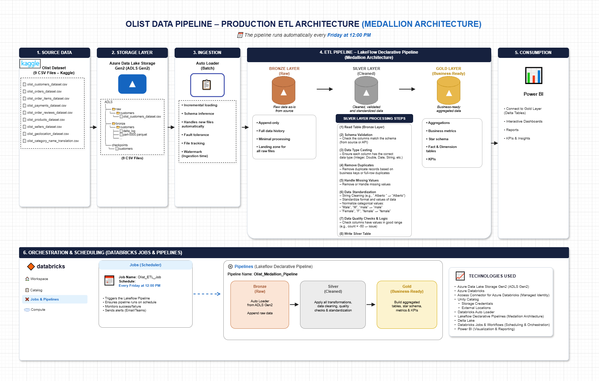
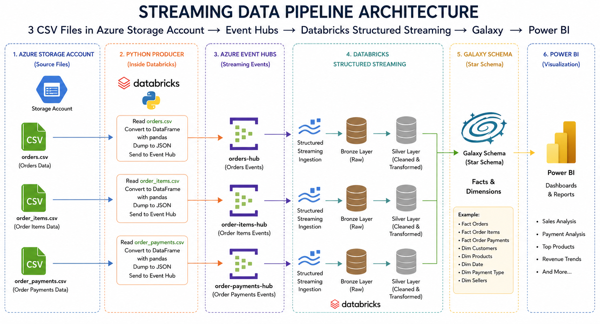

<div align="center">

# 🛒 Olist Hybrid Data Platform

### End-to-End Hybrid (Batch + Real-Time) Lakehouse on Azure Databricks

*Ingesting, cleaning, modeling, and visualizing Brazilian e-commerce data through two production-grade pipelines — one weekly batch, one real-time streaming — unified under a single Medallion Architecture.*

<br>

[](https://azure.microsoft.com/)
[](https://www.databricks.com/)
[](https://delta.io/)
[](https://spark.apache.org/)
[](https://azure.microsoft.com/en-us/products/event-hubs)
[](https://learn.microsoft.com/en-us/azure/databricks/connect/unity-catalog/access-connector)
[](https://www.python.org/)
[](https://powerbi.microsoft.com/)
[](https://www.kaggle.com/datasets/olistbr/brazilian-ecommerce)

</div>

<br>

## 📑 Table of Contents

- [Overview](#-overview)
- [Architecture](#️-architecture)
- [Data Model](#️-data-model)
- [Repository Structure](#-repository-structure)
- [Medallion Architecture](#-medallion-architecture--shared-design-contract)
- [Tech Stack](#️-tech-stack)
- [Business Value](#-business-value--example-insights)
- [Getting Started](#-getting-started)
- [Author](#-author)

<br>

## 📖 Overview

**Olist Hybrid Data Platform** is an end-to-end data engineering project built on top of the public [Olist Brazilian E-Commerce dataset](https://www.kaggle.com/datasets/olistbr/brazilian-ecommerce). It demonstrates how a single Lakehouse can serve two very different ingestion patterns at once:

| | Batch Pipeline | Streaming Pipeline |
|---|---|---|
| **Source** | 9 historical CSV files (Kaggle) | Simulated live order events |
| **Ingestion** | Databricks Auto Loader | Azure Event Hubs (Kafka protocol) |
| **Cadence** | Weekly (every Friday, 12:00 PM) | Continuous (30-second micro-batches) |
| **Output** | Galaxy Schema for BI reporting | Near real-time cleaned Delta tables |

Both pipelines are built on the **Medallion Architecture** (Bronze → Silver → Gold),
- Note: The two pipeline have same ***Gold_Layer***

<br>

## 🏗️ Architecture

### 1️⃣ Batch Pipeline — Weekly Production ETL

Orchestrated by Databricks Jobs and a Lakeflow Declarative Pipeline, running automatically **every Friday at 12:00 PM**.



```
Kaggle CSVs → ADLS Gen2 (Raw_Data) → Auto Loader → Bronze
           → Silver (8-step cleaning + Quarantine) → Gold (Galaxy Schema) → Power BI
```

### 2️⃣ Streaming Pipeline — Real-Time Simulation

A Python producer replays historical orders as live events through Azure Event Hubs, consumed continuously by Spark Structured Streaming.



```
CSV → Python Producer (pandas → JSON) → Azure Event Hubs (3 topics)
    → Structured Streaming → Bronze → Silver → Galaxy Schema → Power BI
```

<br>

## 🗂️ Data Model

**Source schema** — the 9 raw Olist entities and their relationships:


**Gold layer — Galaxy Schema (Fact Constellation):** one Fact table per business process, sharing common Dimension tables. This keeps Sales, Finance, and Reviews independently maintainable while avoiding dimension duplication.

/olist_gold_galaxy_schema_drawio.png)

<br>

## 📁 Repository Structure

```
olist-hybrid-data-platform/
│
├── Azure Storage Account(olistprojectdatalake)/Olist
│   └── Raw_Data/                     # 9 folders, one per source file (batch)
│   └── Bronze_Layer/
│   └── Silver_Layer/
│   └── Gold_Layer/
│   └── Checkpoints/
│   └── Quarantain/
├── Azure Storage Account(olistprojectdatalake)/OlistStreaming                    
│   └── Bronze_Layer/
│   └── Silver_Layer/
│   └── Checkpoints/
├── Ctalog                    
│   └── Illustrative screenshots from Databricks__( Streaming_Data )/
│   └── Illustrative screenshots from Databricks__( Batch_Data )/
│
├── Jobs & Pipelines                    
│   └── Illustrative screenshots from Databricks/
│
├── Olist__Batch__Data/Olist_Batch_Pipeline(medallion architecture )                   # Weekly ETL notebooks
│   ├── Bronze_Layer.py               # Auto Loader ingestion (9 files → Delta)
│   ├── Silver_Layer.py               # 8-step cleaning + quarantine per table
│   └── Gold_Layer.py                 # Galaxy schema: dims, facts, KPI queries
│
├── Olist__Streaming__Data/Olist_Streaming_Pipeline                                    # Real-time ETL notebooks
│   ├── Producer.py                   # Simulates live order events → Event Hub
│   ├── Bronze_Layer.py               # Kafka-protocol ingestion → raw Delta
│   └── Silver_Layer.py               # foreachBatch 8-step cleaning engine
│   └── .env
│
├── Source_Data_OLTP/
│   └── Link__DataSet__(Kaggle).txt 
│   └── olist_customers_dataset.csv
│   └── olist_geolocation_dataset.csv
│   └── olist_order_items_dataset.csv
│   └── olist_order_payments_dataset.csv
│   └── olist_order_reviews_dataset.csv
│   └── olist_orders_dataset.csv
│   └── olist_products_dataset.csv
│   └── olist_sellers_dataset.csv
│   └── product_category_name_translation.csv
│
└── README.md                         # You are here
```

<br>

## 🧱 Medallion Architecture — Shared Design Contract

Both pipelines follow the same 3-layer contract, regardless of how fast data arrives:

| Layer | Purpose | Batch Implementation | Streaming Implementation |
|---|---|---|---|
| 🥉 **Bronze** | Raw, untouched copy of source data | Auto Loader, `trigger(availableNow=True)` | Kafka connector, `trigger(processingTime="30s")` |
| 🥈 **Silver** | Cleaned, validated, deduplicated, standardized | Full 8-step process + Quarantine table | 8-step process via `foreachBatch` |
| 🥇 **Gold** | Business-ready, modeled for BI | Galaxy Schema (dims + facts) | Star/Galaxy Schema (dims + facts) |

**The 8-Step Silver Cleaning Process**

1. Read table from Bronze
2. Schema validation
3. Data type casting
4. Remove duplicates
5. Handle missing values
6. Data standardization (trimming, casing, categorical normalization)
7. Data quality checks & business logic → invalid rows routed to Quarantine
8. Write clean data to Silver

<br>

## ⚙️ Tech Stack

| Category | Tools |
|---|---|
| **Cloud & Storage** | Azure Data Lake Storage Gen2, Unity Catalog |
| **Compute & Orchestration** | Azure Databricks, Databricks Jobs & Workflows, Lakeflow Declarative Pipelines |
| **Processing Engine** | Apache Spark (PySpark), Spark Structured Streaming |
| **Storage Format** | Delta Lake |
| **Streaming / Messaging** | Azure Event Hubs (Kafka-compatible protocol) |
| **Language** | Python 3 |
| **Ingestion** | Databricks Auto Loader (`cloudFiles`), Kafka connector |
| **Visualization** | Power BI |
| **Dataset** | [Olist Brazilian E-Commerce Public Dataset (Kaggle)](https://www.kaggle.com/datasets/olistbr/brazilian-ecommerce) |

<br>

## 📊 Business Value / Example Insights

The Gold layer powers Power BI dashboards that answer real business questions:

- 💰 Total revenue, freight cost, and average order value trends
- 📈 Revenue by month, weekday, and state
- 🏆 Top 10 products and sellers by revenue
- 💳 Payment method distribution and installment behavior
- ⭐ Average review score trends and best/worst rated orders
- 📅 Weekend vs. weekday sales and review performance

<br>

## 🚀 Getting Started

### Batch Pipeline
1. Upload/refresh the matching CSV file into its corresponding folder under `Raw_Data/`.
2. Run `Bronze_Layer.py` — ingests all 9 files via Auto Loader.
3. Run `Silver_Layer.py` — cleans, validates, and quarantines bad records.
4. Run `Gold_Layer.py` — builds the Galaxy Schema dimensions and facts.
5. Connect Power BI to the Gold Delta tables.
6. In production, this runs automatically via Databricks Jobs every **Friday at 12:00 PM**.

### Streaming Pipeline
1. Secure the Event Hub connection string in a Databricks secret scope.
2. Run `Bronze_Layer.py` — starts 3 parallel streams consuming from Event Hub.
3. Run `Silver_Layer.py` — starts 3 parallel cleaning streams (30-second micro-batches).
4. Run `Producer.py` to simulate live order traffic.
5. Query `olist_stream_data.silver.*` — cleaned data appears within ~30 seconds.

<br>


## 👤 Author

Built as an end-to-end data engineering portfolio project demonstrating hybrid batch + streaming Lakehouse architecture on Azure Databricks.

<div align="center">

⭐ If this project was useful or interesting, consider starring the repo!

</div>
